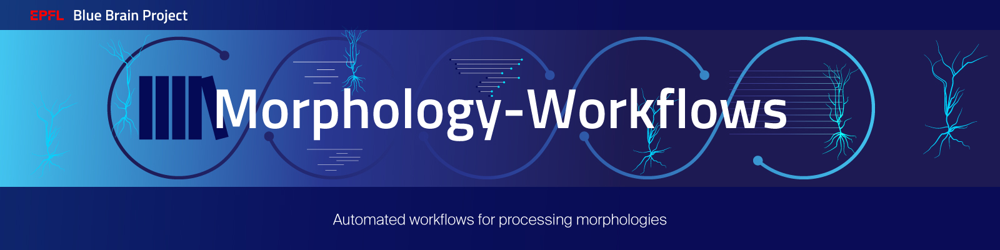

[](https://github.com/BlueBrain/morphology-workflows/releases)
[](https://github.com/BlueBrain/morphology-workflows/actions)
[](https://codecov.io/github/BlueBrain/morphology-workflows?branch=main)
[](https://github.com/BlueBrain/morphology-workflows/blob/main/LICENSE.txt)
[](https://morphology-workflows.readthedocs.io/)


# Morphology Workflows

This project contains several workflows for processing morphologies:
- **Initialize:** create the initial configuration files that the user can then update according to
  its needs.
- **Fetch:** download morphologies from online database (like Allen, NeuroMorpho or MouseLight).
- **Placeholders:** compute the placeholders for a given region and mtype set.
- **Curate:** from raw morphologies, ensures that morphologies can be used with the rest of
  BBP codes (click on the image for more details).
  [](autoapi/tasks/workflows/index.html#tasks.workflows.Curate)
- **Annotate:** create various annotations on morphologies needed by specific BBP codes (click on
  the image for more details).
  [](autoapi/tasks/workflows/index.html#tasks.workflows.Annotate)
- **Repair:** process morphologies to correct for artifacts of in-vitro reconstruction (click on
  the image for more details).
  [](autoapi/tasks/workflows/index.html#tasks.workflows.Repair)


In a nutshell, the user provides a list of morphologies in a ``.csv`` file, with their names and
paths and a ``luigi.cfg`` configuration file. Each workflow is run independently and creates an
output folder, with one subfolder per task. In each, there will be a ``report.csv`` and a ``data``
folder containing the output files of the task if any. In the ``report.csv`` file, columns contain
paths to these files, additional information, error messages if the task failed on that
morphologies, as well as a flag ``is_valid``, used in subsequent tasks to filter valid morphologies.
At the end of each workflow, another ``report.csv`` file is created, with the main output columns of
each tasks, and a ``report.pdf`` containing a human readable summary of the result of the workflow.

Usually, the user should run the ``Curate`` workflow, then the ``Annotate`` workflow and finally the
``Repair`` workflow.

The complete documentation can be found here:
  * stable: https://morphology-workflows.readthedocs.io/en/stable/
  * latest: https://morphology-workflows.readthedocs.io/en/latest/


## Installation

This should be installed using pip:

```bash
pip install morphology-workflows
```


## Usage

### Create inputs for the workflows using the **Initialize** workflow

Usually, user should create a new project folder using this workflow. It will create the files
required to run the other workflows. For example, the command:

```bash
morphology-workflows Initialize --source-database NeuroMorpho
```

will create the inputs to download the morphologies from the NeuroMorpho database and the run the
other workflows on these morphologies.

If the user wants to provide arbitrary morphologies to the **Curate** / **Annotate** / **Repair**
workflows, the following command can be used:

```bash
morphology-workflows Initialize --input-dir <path-to-the-morphologies>
```

in order to create the dataset required by these workflows.

Once the **Initialize** workflows is complete, the user can update the outputs according to its
needs (see the next sections for details about each workflow).

### Create inputs for the **Fetch** workflow

This workflow helps fetching morphologies from online databases. This workflow only needs a
configuration file, which depends on the source from which the morphologies are fetched.

The possible sources are:

* NeuroMorpho
* MouseLight
* Allen

For each of them, the configuration file should be a JSON file containing a list of objects like
the following examples:

* NeuroMorpho:
  ```JSON
  [
      {
          "species": "mouse",
          "brain_region": "neocortex",
          "cell_type": "interneuron",
          "nb_morphologies": 10
      }
  ]
  ```

* MouseLight:
  ```JSON
  [
      {
          "brain_region": "neocortex",
          "nb_morphologies": 10,
          "seed": 0
      }
  ]
  ```

* Allen:
  ```JSON
  [
      {
          "species": "Mus musculus",
          "brain_region": "VISli",
          "cell_type": "pyramidal",
          "nb_morphologies": 10,
          "seed": 0
      }
  ]
  ```

In these examples, the ``seed`` attribute is optional and is only used to sample which morphologies
are fetched among those which pass the filter.

Each `JSON` object in the list will give a set of morphologies to fetch, depending on the given
filters.
Note that all attributes are optional, so it's possible to pass an empty object to fetch all the
morphologies from the database, though it is not recommended.

### Create inputs for the **Curate**, **Annotate** and **Repair** workflows

The **Annotate** and **Repair** workflows should usually be run after the **Curate** workflow since
their inputs should be the outputs of the **Curate** workflow. But it is still possible to run them
on arbitrary inputs (though the morphologies must be valid, as the ones processed by the **Curate**
workflow).

The inputs should consist in:

* a directory containing the input morphologies.
* a CSV file with the following columns:
    1. ``morph_path``: the path to the morphology file.
    2. ``morph_name``: the name of the morphology.
    3. ``mtype``: the morphology-type of the morphology (this column is optional).

  Any other column is kept into the results but not used in the workflows.

  Note that the column names should not contain spaces between commas and names.
* a ``luigi.cfg`` file containing the configuration for all the tasks of the workflow.
* an optional ``logging.conf`` file containing the logging configuration. If you prefer default logging
  behavior, remove this file and comment line in ``logging_conf_file = logging.conf`` in ``luigi.cfg``.

The [examples](https://github.com/BlueBrain/morphology-workflows/tree/main/examples) folder contains
examples for the ``luigi.cfg`` and ``logging.conf`` files.

These inputs can be created using the **Fetch** workflow that downloads morphlogies from online
databases and create the dataset in the correct format.


### Run the workflows

These workflows are based on the ``luigi`` library but can be run via the command line interface.
For example, you can run the ``Curate`` workflow with the following command:

```bash
morphology-workflows Curate
```

> **NOTE:** This command must be executed from a directory containing a ``luigi.cfg`` file.
> An example of such file is given in the ``examples`` directory.

By default, a local scheduler is used but it is also possible to use a Luigi's master scheduler
using the `-m / --master-scheduler` trigger:

```bash
morphology-workflows -m Curate
```

Once the **Curate** workflow has run, the **Annotate** and **Repair** workflows can be run
directly, they will just take the results of the **Curate** workflow as input:

```bash
morphology-workflows Annotate
morphology-workflows Repair
```

Note that it is also possible to run the 3 workflows directly because each workflow depends on each other:
```bash
morphology-workflows Repair
```

More details can be found in the command line interface section of the documentation or by running
the commands:

```bash
morphology-workflows --help
morphology-workflows <workflow> --help
```


## Results

Each workflow will create several new directories, one for each sub-step. These new directories can
be nested into a global result directory for each workflow, using the ``result_path`` parameter.
These directories contain intermediate data so it is possible to understand why a morphology
could not be validated at a given step.
The invalid morphologies should be manually fixed before being processed again by the workflows.

The main workflows (**Curate**, **Annotate** and **Repair**) will also create a final CSV file
which contains most of the relevant data of the workflow (main sub-step results and final
morphology paths). Finally, the **Repair** workflow can generate morphology releases that contain
the final morphologies that could be validated and automatically fixed by the workflow. Usually
these morphologies are the most relevant ones for later use.


## Examples

The [examples](https://github.com/BlueBrain/morphology-workflows/tree/main/examples) folder contains
a simple example that will fetch and process a set of morphologies.
A ``dataset.csv`` file is provided which is taken as input for the workflows. A ``luigi.cfg`` file
is also provided to give a default configuration for the workflows.
This example can simply be run using the following command:

```bash
./run_curation.sh
```

This script will create a new directory ``out_curated`` which will contain the report and all the
results.


## Funding & Acknowledgment

The development of this software was supported by funding to the Blue Brain Project, a research
center of the École polytechnique fédérale de Lausanne (EPFL), from the Swiss government’s ETH Board
of the Swiss Federal Institutes of Technology.

For license and authors, see `LICENSE.txt` and `AUTHORS.md` respectively.

Copyright © 2021-2022 Blue Brain Project/EPFL
